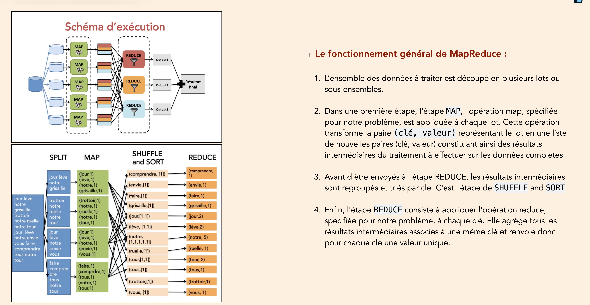
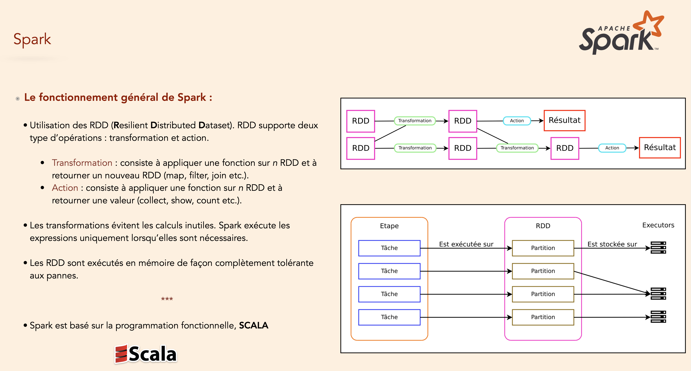

# Introduction to Data Engineering
A mini course on data engineering in Data Science Master Program at Galatasaray University

To use the application.

1. Open your terminal (or PowerShell for Windows)
2. Run the command below

```shell
python app.py <article>
```

by replacing ``<article>`` by the name of a wikipedia article. For instance,

```shell
python app.py "Earth"
```

<div align="center">



</div>
